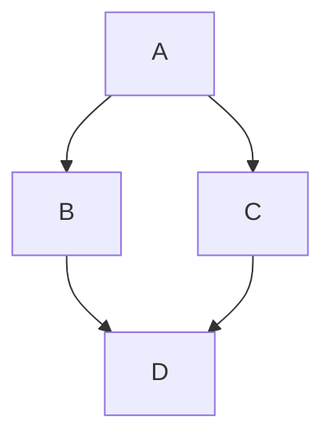

# My reviewer for the GH-900: Github Foundations Exam
## Summary
This serves as a study plan for **GH-900: Github Foundations** certification exam

This is for _personal_ use only and is not intended to serve as an official guide

This repo has the following
1. Readme.md (This file)
2. a [wiki](https://github.com/pierce23john/gh-900/wiki)

## Daily Breakdown

| Day | Topic | Resources |
|---|---|---|
| Mon | GitHub Actions: YAML syntax deep dive; workflow triggers | [GitHub Docs — Workflow Syntax](https://docs.github.com/en/actions/writing-workflows/workflow-syntax-for-github-actions) |
| Tue | Actions: secrets, environment variables, contexts | [GitHub Docs — Contexts](https://docs.github.com/en/actions/writing-workflows/choosing-what-your-workflow-does/accessing-contextual-information-about-workflow-runs) |
| Wed | GitHub Packages: publish/consume packages | [GitHub Docs — Packages](https://docs.github.com/en/packages) |
| Thu | GitHub Projects (v2): boards, automation, roadmaps | [GitHub Docs — Projects](https://docs.github.com/en/issues/planning-and-tracking-with-projects) |
| Fri | GitHub Insights: traffic, contributors, pulse | [GitHub Docs — Insights](https://docs.github.com/en/repositories/viewing-activity-and-data-for-your-repository) |
| Sat | **Practical Lab 5** (see below) | |
| Sun | Rest or catch-up | |

🧑‍🎓
